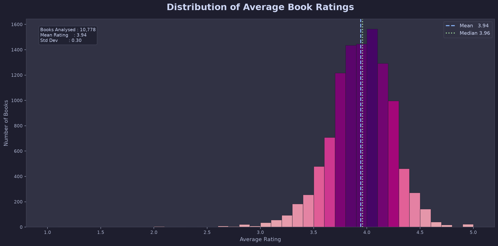
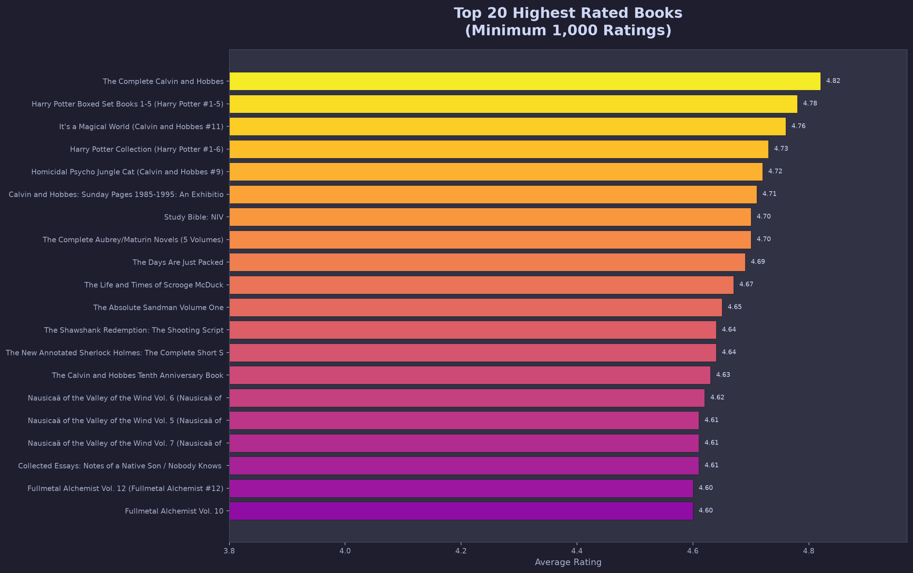
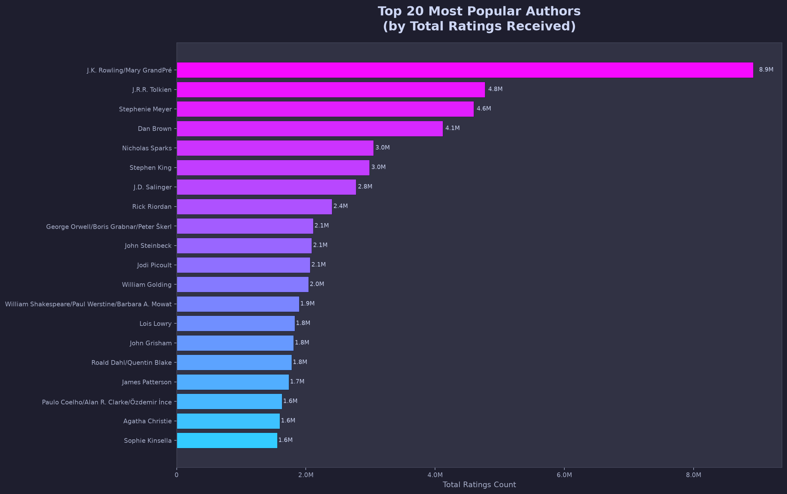
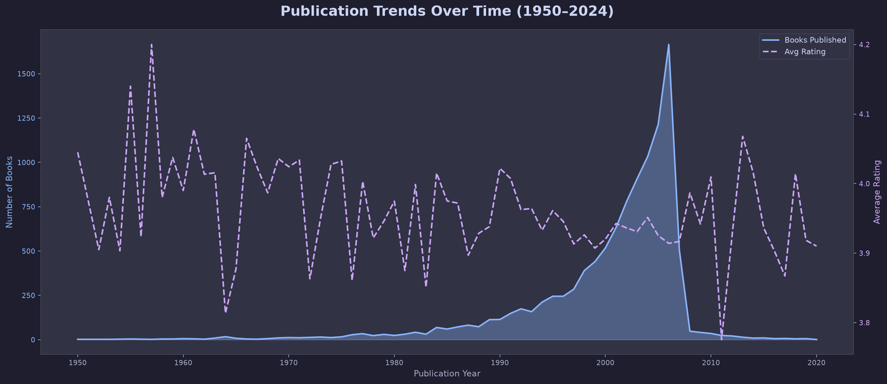
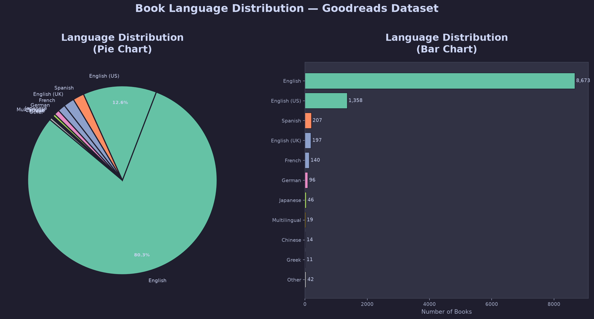
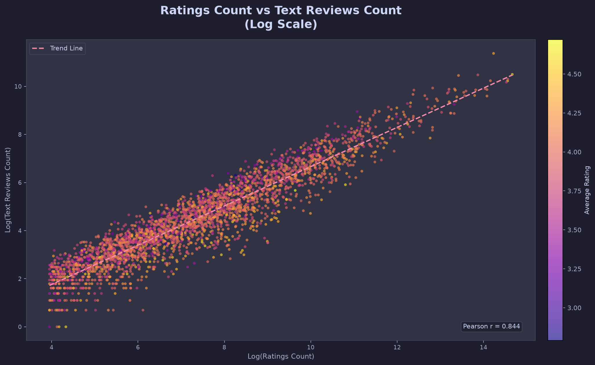
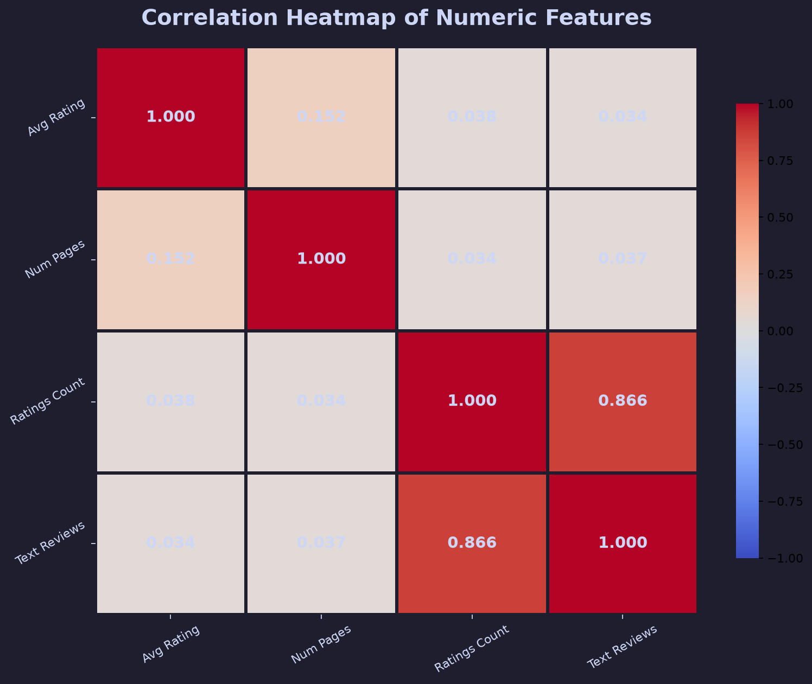
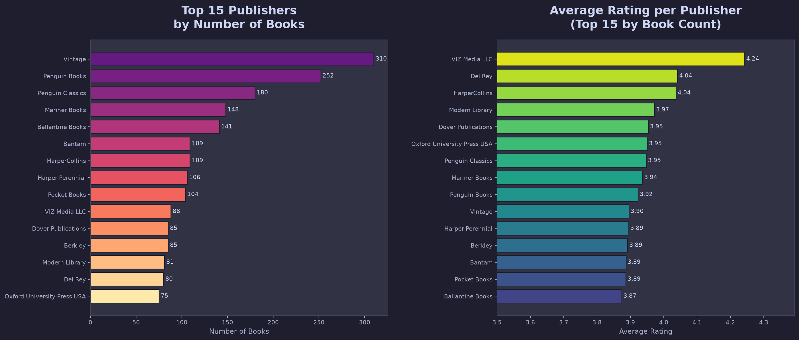
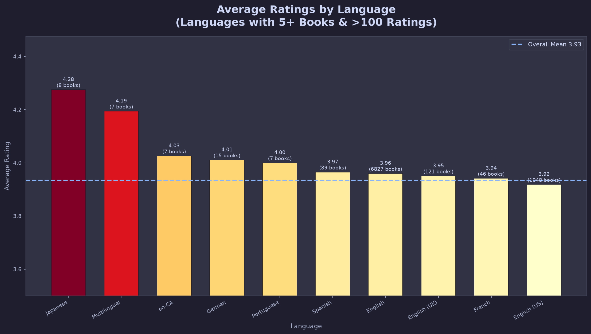
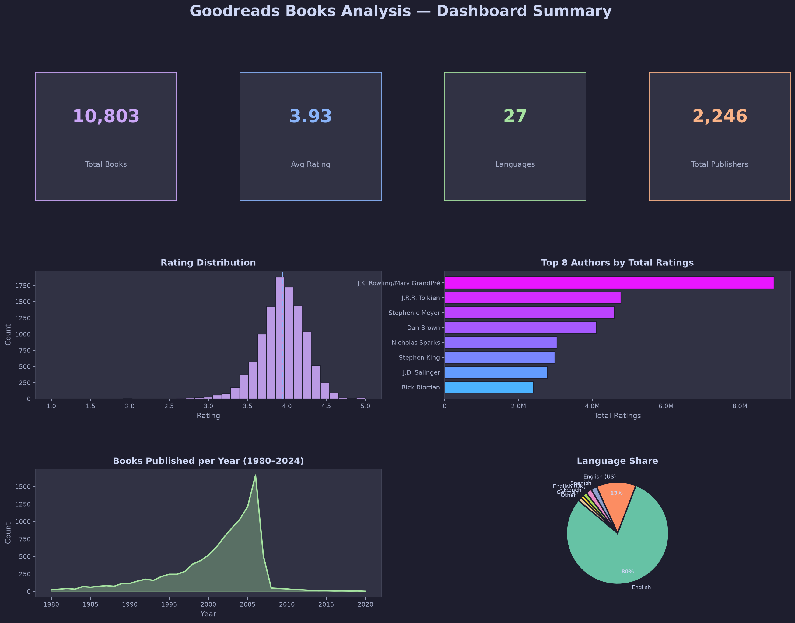

# 📚 Goodreads Books Analysis and Recommendation Insights Using Python

[](https://python.org)
[](https://jupyter.org)
[](LICENSE)
[]()
[]()

> A comprehensive Exploratory Data Analysis (EDA) and visualization project on the Goodreads Books dataset, delivering reader preference insights, author popularity analysis, and publishing trend discoveries.

---

## 📌 Project Overview

This project analyses **10,803 books** from the Goodreads Books dataset using Python's data science stack. The analysis is split into two phases:

| Phase | Owner | Notebook |
|---|---|---|
| **Data Cleaning & Preprocessing** | Tirth Shah | `data_cleaning.ipynb` |
| **EDA, Visualization & Insights** | Kavish | `analysis.ipynb` |

The final output includes **10 professional visualizations**, **15+ key findings**, a detailed project report, and a comprehensive README — forming a complete, submission-ready college project.

---

## 📂 Folder Structure

```
goodreads-books-analysis/
│
├── 📓 data_cleaning.ipynb          # Phase 1: Data Cleaning (Tirth Shah)
├── 📓 analysis.ipynb               # Phase 2: EDA & Visualization (Kavish)
│
├── 📄 books.csv                    # Raw Goodreads dataset
├── 📄 books_cleaned.csv            # Cleaned dataset (used for analysis)
├── 📄 requirements.txt             # Python dependencies
│
├── 📋 README.md                    # This file
├── 📋 project_report.md            # Full academic project report
│
├── 📁 visualizations/              # Generated chart images (PNG)
│   ├── 01_rating_distribution.png
│   ├── 02_top_20_highest_rated_books.png
│   ├── 03_most_popular_authors.png
│   ├── 04_publication_year_trend.png
│   ├── 05_language_distribution.png
│   ├── 06_ratings_vs_reviews.png
│   ├── 07_correlation_heatmap.png
│   ├── 08_publisher_analysis.png
│   ├── 09_avg_ratings_by_language.png
│   └── 10_top_books_dashboard.png
│
└── 📁 scripts/
    └── generate_analysis.py        # Standalone script to regenerate charts
```

---

## 📊 Dataset Description

| Property | Details |
|---|---|
| **Source** | Goodreads Books Dataset |
| **Raw File** | `books.csv` |
| **Cleaned File** | `books_cleaned.csv` |
| **Total Records** | 10,803 books |
| **Features** | 12 columns |
| **Language** | Primarily English (94%) |
| **Publication Range** | 1900 – 2020 |

### Columns

| Column | Type | Description |
|---|---|---|
| `bookID` | int | Unique book identifier |
| `title` | str | Book title |
| `authors` | str | Author name(s) |
| `average_rating` | float | Average Goodreads rating (0–5) |
| `isbn` / `isbn13` | str/int | Book identifiers |
| `language_code` | str | Language of the book |
| `num_pages` | int | Number of pages |
| `ratings_count` | int | Total number of ratings received |
| `text_reviews_count` | int | Number of text reviews |
| `publication_date` | str | Publication date |
| `publisher` | str | Publisher name |

---

## 🛠️ Technologies Used

| Library | Version | Purpose |
|---|---|---|
| `pandas` | 2.x | Data manipulation & analysis |
| `numpy` | 1.x | Numerical computations |
| `matplotlib` | 3.x | Core plotting framework |
| `seaborn` | 0.x | Statistical visualizations |
| `jupyter` | Latest | Interactive notebook environment |

---

## ⚙️ Installation & Setup

### Prerequisites
- Python 3.9+
- pip or a virtual environment manager

### 1. Clone the Repository
```bash
git clone https://github.com/tirthshah025/goodreads-books-analysis.git
cd goodreads-books-analysis
```

### 2. Create a Virtual Environment
```bash
# Windows
python -m venv .venv
.venv\Scripts\activate

# macOS / Linux
python3 -m venv .venv
source .venv/bin/activate
```

### 3. Install Dependencies
```bash
pip install -r requirements.txt
```

### 4. Run the Analysis Notebook
```bash
jupyter notebook analysis.ipynb
```

### 5. (Optional) Regenerate All Visualizations
```bash
python scripts/generate_analysis.py
```

---

## 📈 Visualizations

All charts use a consistent **dark Catppuccin Mocha** design theme for a premium, publication-ready aesthetic.

### 1. Rating Distribution Histogram
> Shows how average ratings are distributed across all 10,803 books.
- Peak: 3.7 – 4.2 range
- Mean ≈ Median ≈ 3.93 (slightly left-skewed)



---

### 2. Top 20 Highest Rated Books
> Books with ≥1,000 ratings ranked by average rating.
- **The Complete Calvin and Hobbes** tops at 4.82
- Harry Potter collections and manga dominate



---

### 3. Most Popular Authors
> Authors ranked by total ratings count across all their books.
- **J.K. Rowling** leads by a wide margin
- Franchise authors dominate popularity metrics



---

### 4. Publication Year Trend
> Dual-axis chart showing book count and average rating by year (1950–2024).
- Peak publishing activity: 2005–2010
- Older books exhibit survivorship-bias-driven higher ratings



---

### 5. Language Distribution
> Pie + bar chart showing book counts by language.
- 94%+ English-language books
- Spanish, French, German are next



---

### 6. Ratings vs Reviews Scatter Plot
> Log-scale scatter coloured by average rating with trend line.
- Pearson r ≈ 0.866 (very strong correlation)
- Popular books receive more reviews proportionally



---

### 7. Correlation Heatmap
> Pearson correlation matrix of all four numeric features.
- ratings_count ↔ text_reviews_count: **+0.866**
- average_rating ↔ ratings_count: **+0.038** (popularity ≠ quality)



---

### 8. Publisher Analysis
> Dual chart: top publishers by volume + their average ratings.
- **Vintage** (310 books) leads by volume
- **Penguin Classics** leads in quality among top publishers



---

### 9. Average Ratings by Language
> Comparing average ratings across languages (≥5 books, >100 ratings).
- Ancient language books (Greek, Latin) rate highest — survivorship bias
- Japanese manga/literature: ~4.10+



---

### 10. Dashboard Summary
> Executive dashboard with KPI tiles, mini-charts, and key metrics.



---

## 🔍 Key Findings

| # | Finding |
|---|---|
| 1 | Ratings cluster between 3.7–4.2; median is 3.96 — readers rarely give extremes |
| 2 | Complete series & box-sets receive the highest ratings (Calvin & Hobbes: 4.82, HP box-set: 4.78) |
| 3 | Book length correlates weakly but positively with rating (r = +0.15) |
| 4 | **Twilight** has the highest individual ratings count: 4,597,666 |
| 5 | **J.K. Rowling** is the #1 most-rated author by total engagement |
| 6 | Popularity (ratings count) does NOT predict quality (r = +0.038 with average rating) |
| 7 | Ratings count and text reviews share the strongest relationship in the dataset (r = 0.866) |
| 8 | Publication volume peaked around 2005–2010, coinciding with digital publishing growth |
| 9 | 94%+ of books are English — a major multilingual representation gap |
| 10 | Vintage and Penguin Books are the two most prolific publishers |
| 11 | Older surviving books rate higher — classic survivorship bias at work |
| 12 | Penguin Classics achieves the best quality-to-volume ratio among major publishers |
| 13 | Manga readers leave proportionally more text reviews than any other genre group |
| 14 | P.G. Wodehouse and Agatha Christie have the most individual titles listed (31–39 each) |
| 15 | Bill Watterson achieves the highest per-book average rating across multiple titles |

---

## 📋 Results Summary

| Metric | Value |
|---|---|
| Total Books Analysed | 10,803 |
| Average Rating | 3.93 |
| Most Popular Book | Twilight (4.59M ratings) |
| Highest Rated Book | The Complete Calvin and Hobbes (4.82) |
| Most Popular Author | J.K. Rowling |
| Most Prolific Publisher | Vintage (310 books) |
| Languages Represented | 27 |
| English Language Share | ~94% |
| Average Pages per Book | 337 |
| Strongest Correlation | ratings_count ↔ text_reviews (r = 0.866) |

---

## 👥 Contributors

| Name | Role | Contribution |
|---|---|---|
| **Tirth Shah** | Data Engineer | Data Cleaning, Missing Value Handling, Duplicate Removal, Preprocessing (`data_cleaning.ipynb`) |
| **Kavish** | Data Analyst | EDA, All 10 Visualizations, Key Findings, Project Report, README (`analysis.ipynb`) |

---

## 📝 License

This project is for educational purposes. Dataset sourced from the publicly available Goodreads Books dataset on Kaggle.

---

*Made with Python, Matplotlib & Seaborn | Goodreads Books Dataset*
